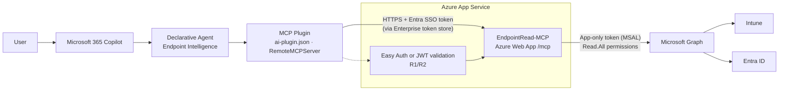

# Microsoft 365 Copilot MCP Plugin Assessment — EndpointRead-MCP

**Phase:** 1 (assessment only — no implementation)
**Target (revised):** **Copilot Cowork plugin** "Endpoint Intelligence" (skills + remote MCP connector to EndpointRead-MCP-DataHub). See section 9.
**Original target:** Declarative agent with an MCP plugin. Sections 3–5 were written for that target, and section 9 lists the differences.
**Integration folder (Phase 2+):** `integrations/m365-copilot-endpoint-intelligence`

> All tenant IDs, client IDs, secrets, and hostnames in this document are placeholders.
> The live server URL is referred to as `https://<APP_NAME>.<REGION>.azurewebsites.net/mcp` (`MCP_SERVER_URL`).

---

## 1. Sources used

| Topic | Official source |
|---|---|
| MCP plugin for declarative agents (Agents Toolkit ≥ 6.12.0) | https://learn.microsoft.com/microsoft-365-copilot/extensibility/build-mcp-plugins |
| Plugin authentication schemes | https://learn.microsoft.com/microsoft-365-copilot/extensibility/plugin-authentication |
| Entra SSO for MCP plugins | https://learn.microsoft.com/microsoft-365-copilot/extensibility/plugin-authentication-entra-sso |
| Dynamic vs pinned tools (`RemoteMCPServer` runtime) | https://learn.microsoft.com/microsoft-365-copilot/extensibility/plugin-dynamic-tool-discovery |
| Plugin manifest schema | https://learn.microsoft.com/microsoft-365-copilot/extensibility/plugin-manifest-2.4 |
| **Copilot Cowork plugin development** | https://learn.microsoft.com/microsoft-365/copilot/cowork/cowork-plugin-development |

---

## 2. Repository findings

### 2.1 Framework and transport

| Item | Finding | Evidence |
|---|---|---|
| MCP framework | Official MCP Python SDK, `FastMCP` class (`mcp.server.fastmcp`) | `intune_mcp_server/server.py` L24, L58-L64 |
| SDK version | `pyproject.toml` pins `mcp==1.26.0`; `requirements.txt` allows `mcp>=1.0.0,<2.0.0`. Live server reports `1.29.0` → **version drift** | `pyproject.toml`, live `initialize` response |
| Python | 3.11 on Azure (`>=3.10` supported) | `.github/workflows/main_endpointread-mcp.yml` |
| Transports | `stdio` (local, `main()`) and **Streamable HTTP** (`mcp.streamable_http_app()`) | `server.py` L67-L69, `intune_mcp_server/mcp_app.py` |
| HTTP endpoint | `/mcp` (SDK default path) | `mcp_app.py` |
| Response mode | `json_response=True` (no SSE streaming) | `server.py` L61 |
| Session mode | `stateless_http=True` (safe for multi-instance App Service) | `server.py` L62 |
| Host protection | DNS-rebinding protection; allows localhost + `WEBSITE_HOSTNAME` | `server.py` L31-L54 |
| Live probe | Unauthenticated `initialize` → **HTTP 200**, protocol `2025-06-18` | Probe run during Phase 1 (no data tools called) |

### 2.2 Tool registration

- 34 tools registered with `@mcp.tool()` in `server.py`.
- 25 tools are action-routed (`manage_*`, `action` parameter). **Every one** starts with an `allowed_actions` allowlist and returns an error for any other action. Verified by script: 25 guards for 25 action tools.
- 8 auth/session tools: `authenticate_mcp_session`, `test_connection`, `get_auth_status`, `start_interactive_sign_in`, `complete_interactive_sign_in`, `complete_interactive_login`, `connect_intune_mcp_server`, plus `get_intune_overview`.
- 1 catalog tool: `discover_graph_operations`.

**Read-only boundary:** enforced in two layers:
1. Code allowlists (above).
2. Graph application permissions are all `*.Read.All` (README L87-L96).

**Important observation:** the code still contains dormant write branches (wipe, retire, delete, CA policy changes, user changes, and so on) after the allowlist guard, and **tool docstrings still advertise those write actions**. They are unreachable, but the descriptions are sent to clients in `tools/list`.

### 2.3 Authentication

| Direction | Current state |
|---|---|
| **Inbound** (client → `/mcp`) | **None in code.** The live endpoint accepts anonymous MCP requests. You need to confirm whether App Service Authentication (Easy Auth) is configured. The probe suggests it isn't enforced. |
| **Outbound** (server → Graph) | MSAL. `AUTH_MODE` = `app` (client credentials, default), `delegated` (device code/browser), or `hybrid`. Delegated token cache is a **file** (`TOKEN_CACHE_PATH`). |
| Env var names | `TENANT_ID`, `CLIENT_ID`, `CLIENT_SECRET`, `AUTH_MODE`, `REQUIRE_USER_LOGIN`, `USER_AUTH_SCOPES`, `INTERACTIVE_LOGIN_MODE`, `TOKEN_CACHE_PATH`, `GRAPH_ENDPOINT`, `BETA_ENDPOINT` |

### 2.4 Graph permission model

- **Application** permissions (app-only), all read: `Organization.Read.All`, `User.Read.All`, `Group.Read.All`, `AuditLog.Read.All`, `Device.Read.All`, `DeviceManagementManagedDevices.Read.All`, `DeviceManagementConfiguration.Read.All`, `DeviceManagementApps.Read.All`, `DeviceManagementServiceConfig.Read.All`, `DeviceManagementRBAC.Read.All`.
- BitLocker key retrieval (`/informationProtection/bitlocker/recoveryKeys`) needs `BitLockerKey.Read.All` / `BitLockerKey.ReadBasic.All`. Those permissions aren't listed in the README, so expect HTTP 403 unless someone granted them separately.
- Effect: **every caller sees tenant-wide data with the app's permissions.** The user's own Intune RBAC role and scope tags aren't applied.

### 2.5 Data freshness (live vs stored)

| Source | Type |
|---|---|
| `manage_*` list/get/search actions | **Live** Graph reads |
| `manage_intune_reports` export jobs (`POST /deviceManagement/reports/exportJobs`) | **Intune-generated report snapshot.** Intune refreshes it on its own schedule, so it can lag live state. |
| Endpoint Analytics, `*Summary`/`*Aggregate` reports | **Aggregated** service-side data |
| Server-side storage | None (no DB/blob). Only the MSAL token cache file is stored. |

### 2.6 Deployment

- GitHub Actions → `azure/webapps-deploy@v3`, **publish-profile** secret, Oryx build on App Service.
- Two workflows: `main_endpointread-mcp.yml` (this app) and `main_endpointread-mcp-datahub.yml` (separate app, out of scope).
- No `startup.sh`/Procfile in the repo. The App Service startup command is configured in Azure and still needs confirmation (expected to target `intune_mcp_server.mcp_app:app`).
- `bridge.py` (FastAPI REST bridge, no auth) exists. Need to confirm whether it's served in Azure.

### 2.7 Logging and errors

- No application logging. Caller identity and tool usage aren't recorded.
- Errors are returned as structured JSON (`error`, `status: auth_required`, Graph `403` text). Empty results return `count: 0`. These results work with the "no fabrication" agent rules.

---

## 3. Compatibility verdict

| Requirement (M365 Copilot MCP plugin) | Status |
|---|---|
| Remote MCP server over HTTPS | ✅ |
| Streamable HTTP transport | ✅ |
| Works statelessly across instances | ✅ |
| Supported auth scheme (Entra SSO / OAuth / DCR / None) | ⚠️ Currently **None**. That works technically, but it's **not acceptable** for tenant-wide Intune/Entra data. |
| Tool schemas usable for pinned or dynamic discovery | ✅ (tools are discoverable via `tools/list`) |
| Read-only | ✅ enforced by allowlists + read-only Graph permissions |

**Verdict:** The server is **protocol-compatible today**. It isn't **security-ready** until inbound Entra authentication and caller authorization are in place.

---

## 4. Changes that are genuinely required

| # | Change | Why | Where | Server code change? |
|---|---|---|---|---|
| R1 | **Protect `/mcp` with Microsoft Entra ID** and accept the Application ID URI from the Entra SSO auth config as a token audience. Allow the Microsoft Enterprise token store client ID `ab3be6b7-f5df-413d-ac2d-abf1e3fd9c0b`. | Anonymous endpoint + app-only Graph = anyone who reaches the URL can read tenant data. The Entra SSO doc requires this audience/client update. | **Option A:** App Service Authentication (Easy Auth). No code change. **Option B:** JWT validation middleware in `mcp_app.py`. | A: No · B: Yes (small) |
| R2 | **Restrict who can call it.** Turn on "Assignment required" on the enterprise app and assign an approved security group (or check an app role). | Authentication alone admits any user in the tenant. | Entra admin center (+ role check if Option B) | No / small |
| R3 | **Make tool descriptions read-only.** Remove write actions (wipe, delete, and so on) from the `manage_*` docstrings. Leave the logic unchanged. | Descriptions reach the model and the admin review. Advertising "wipe" contradicts the read-only boundary and can mislead users. | `server.py` docstrings only. Alternative: edit descriptions only in the pinned `mcp-tools.json` inside the plugin. | Docstrings only |
| R4 | **Confirm Azure app settings:** `AUTH_MODE=app`, `REQUIRE_USER_LOGIN=false`. Exclude the interactive sign-in tools from the agent. | With `delegated`/`hybrid` on a shared web app, one user's cached token (file cache) would serve every caller. | Azure configuration + plugin tool pinning | No |

**Not required:** changes to transport, `/mcp` path, JSON mode, stateless mode, Graph logic, or the deployment pipeline.

### Impact on Copilot Studio
Resolved: Copilot Studio uses a separate web app. R1/R2 apply to **EndpointRead-MCP-DataHub** only (see section 7).

---

## 5. Recommended (not blocking)

- **Pin tools** instead of using dynamic discovery. Agents Toolkit defaults to dynamic discovery, so you'd need to change this. Pinning lets you expose only an approved subset (proposal below).
- Add minimal **audit logging**: caller object ID, tool name, action, result status. Don't log tokens or response bodies.
- Align the `mcp` version between `pyproject.toml` and `requirements.txt`.
- Move deployment from publish profile to OIDC federated credentials.
- If `bridge.py` is reachable in Azure, protect it or don't deploy it.
- Future: switch Graph calls to on-behalf-of (OBO) so the user's Intune RBAC and scope tags apply. This is a larger change and out of scope now.

### Proposed pinned tool set (for approval in Phase 2)

| Include | Exclude (reason) |
|---|---|
| `get_intune_overview`, `manage_intune_devices`, `manage_intune_apps`, `manage_app_config_mam`, `manage_compliance_policies`, `manage_configuration_profiles`, `manage_settings_catalog`, `manage_admx_policies`, `manage_endpoint_security`, `manage_security_baselines`, `manage_windows_update`, `manage_autopilot`, `manage_intune_enrollment`, `manage_filters_tags`, `manage_cloud_pc`, `manage_intune_reports`, `manage_entra_devices`, `manage_entra_users`, `manage_entra_groups`, `test_connection`, `discover_graph_operations` | Interactive sign-in/session tools (not applicable to Copilot; shared-cache risk) · `manage_device_encryption` (BitLocker/FileVault **recovery keys**; use `manage_intune_reports` → `encryption_report` instead) · `manage_intune_scripts` (script content may contain embedded secrets) · `manage_identity_protection` (sign-in logs, risky users) · `manage_app_registrations` · `manage_tenant_admin` · `manage_conditional_access` · `manage_intune_rbac` |

> The excluded tools stay on the server for Copilot Studio. Pinning only limits what this agent can call. It doesn't block other authenticated clients (R2 covers that).

---

## 6. Architecture

---

## 7. Decisions recorded

| Question | Answer |
|---|---|
| Easy Auth enabled? | **No** (not configured) |
| Startup command | `gunicorn --bind=0.0.0.0 --timeout 600 -k uvicorn.workers.UvicornWorker intune_mcp_server.mcp_app:app` → serves `/mcp`; `bridge.py` is **not** served |
| Copilot Studio | Uses a **separate** web app (EndpointRead-MCP) with its own app settings |
| M365 Copilot target | **EndpointRead-MCP-DataHub** (confirmed; deployed by `main_endpointread-mcp-datahub.yml`) |
| `AUTH_MODE` | `app` ✅. `REQUIRE_USER_LOGIN` is not set, and it defaults to `false` (`config.py` L41). The setting only applies in `hybrid` mode, so **R4 is satisfied**. |
| Allowed users (R2) | Entra security group **EndpointRead-MCP-DataHub** |
| Pinned tool set | **Accepted** by project owner (section 5) |
| R1 option | **A — App Service Authentication (Easy Auth)**, applied to **DataHub only** |
| R3 option | **Server docstrings fixed** (see below) |

Because Easy Auth is applied only to DataHub, the Copilot Studio app is **not affected**.

### R3 — completed

- `intune_mcp_server/server.py`: tool docstrings now list **only** the allowlisted read actions. Write-action wording has been removed.
- No logic, signatures, or allowlists changed.
- Validation: AST check confirms the documented actions equal `allowed_actions` for all 25 action tools (0 mismatches).
- Takes effect on both web apps after the next deployment from `main`.

### Approval roles

| Stage | Who approves | What they approve |
|---|---|---|
| Design (now) | **Project owner** (you) | The tool list and agent behavior |
| Security sign-off (before production) | **Security reviewer / Entra admin** | Graph permissions, inbound auth, data exposure |
| Publishing to the organization | **Microsoft 365 admin** (Global Admin or AI Admin) | Accepts the submitted agent in the Microsoft 365 admin center and assigns it to users/groups |

One person can hold several roles in a small team, but production publishing always requires an admin action in the Microsoft 365 admin center.

### Still open

1. Agents Toolkit and tenant readiness (deferred by owner; needed before sideloading in Phase 3).

---

## 8. Phase 1 risks

| Risk | Severity |
|---|---|
| `/mcp` is anonymously reachable while backed by tenant-wide app-only Graph permissions (DataHub: fixed by R1/R2; the **Copilot Studio app stays anonymous**, which is outside this project but still exposed) | **Critical** |
| User RBAC/scope tags aren't applied (app-only) | High (mitigated by R2 + server-side allowlist R5) |
| Tool descriptions advertise destructive actions | ~~Medium~~ Resolved (R3) |
| Delegated/hybrid mode + shared file token cache on web app | High if not `app` mode |
| Enabling auth may break the current Copilot Studio connection | ~~Medium~~ Resolved (separate app) |
| Cowork ignores client-side tool pinning → excluded tools (e.g., BitLocker keys) would be reachable | **High** until R5 |
| Tools without annotations trigger confirmation prompts on every call | Medium until R6 |
| Report exports exceed Cowork's 30 s tool-call limit | Medium until R7 |
| SDK version drift (1.26.0 pinned vs 1.29.0 deployed) | Low |
| **Test tenant (accepted):** one app registration (`EndpointRead-MCP-DataHub-API`) is both the Graph app (`CLIENT_ID`, Application `*.Read.All`) and the Cowork OAuth client. A leaked connector secret would allow direct tenant-wide Graph reads. **Split into two app registrations before production.** | High (accepted for test) |

---

## 9. Copilot Cowork review (revised target)

### 9.1 What a Cowork plugin is

A Cowork plugin is a Microsoft 365 app package (`.zip`). It contains:

- `manifest.json`: the unified app manifest, **v1.29** with the `wiqd` CLI or **v1.28** if you write it by hand.
- `color.png` (192×192) and `outline.png` (32×32).
- `skills/<name>/SKILL.md`: up to **20** skills. Skills are the plugin's instructions and workflows.
- `agentConnectors[]` in the manifest: up to **10** remote MCP servers (`toolSource.remoteMcpServer.mcpServerUrl`).

There's **no** `declarativeAgent.json`, `ai-plugin.json`, or conversation-starter list. The skills replace agent instructions.

### 9.2 Differences from the declarative-agent plan

| Topic | Declarative agent plan | Cowork reality | Impact |
|---|---|---|---|
| Tool pinning | `run_for_functions` + `mcp_tool_description` limit the tools | Cowork **always discovers tools dynamically** and ignores `mcpToolDescription` | Pinning can't restrict tools. **The allowlist must live on the server** (R5). |
| Behavior rules | Agent instructions | `SKILL.md` workflows (body < ~5,000 tokens; details go in `references/`) | Write the rules (no fabrication, data-source labeling, minimal sensitive data) **inside each skill** |
| Office outputs | Agent instructions | Cowork built-in skills already create documents, and the docs say not to duplicate them | Our skills produce structured content; Cowork's built-in skills build the Word/Excel/PowerPoint/email files |
| Auth types | Entra SSO / OAuth / DCR / None | Documented for Cowork connectors: `None`, `OAuthPluginVault`, DCR (Cowork only). API key isn't available yet. | Use **`OAuthPluginVault` with Entra ID as the OAuth provider** (R1 revised). Entra SSO isn't documented for Cowork, so we don't use it. |
| Tool confirmations | Not relevant | Tools **without MCP annotations are treated as destructive** and require user confirmation | Add `readOnlyHint: true` annotations (R6) |
| Tool-call time | Not stated | **Under 30 seconds per tool call** | Intune report export polling (default 120 s) must be capped (R7) |
| Mobile | \u2014 | Custom plugins aren't supported in Cowork on mobile | Document as a limitation |
| Information Barriers | \u2014 | Not supported for plugin/skill management | Check whether the tenant uses Information Barriers |

### 9.3 Required changes (revised)

| # | Change | Where | Status |
|---|---|---|---|
| R1 | Easy Auth on **DataHub**. Connector auth = **`OAuthPluginVault`** using an Entra OAuth client (authorization-code flow). Redirect URI `https://teams.microsoft.com/api/platform/v1.0/oAuthRedirect`. Scope = the API's `user_impersonation` scope plus `offline_access`. | Entra + App Service + auth config | Planned (Phase 2) |
| R2 | "Assignment required" + group **EndpointRead-MCP-DataHub** | Entra | Planned (Phase 2) |
| R3 | Read-only tool descriptions | `server.py` | \u2705 Done |
| R4 | `AUTH_MODE=app` | Azure config | \u2705 Done |
| **R5** | **Server-side tool allowlist.** A new optional app setting lists the tools to expose. If it isn't set, all tools are exposed, so the Copilot Studio app doesn't change. DataHub sets it to the approved list in section 5. | `server.py` (small) + DataHub app setting | ✅ Code done (Phase 2): `MCP_ENABLED_TOOLS` |
| **R6** | **MCP tool annotations** on every tool: `readOnlyHint=true`, `destructiveHint=false`, plus a `title` | `server.py` decorators | ✅ Done (Phase 2) |
| **R7** | **Keep tool calls under 30 s.** Make the report export timeout configurable. DataHub sets it below 30 s, and a timeout returns a clear "report still generating" result. | `server.py` (small) + DataHub app setting | ✅ Code done (Phase 2): `REPORT_EXPORT_TIMEOUT_SECONDS` |

Recommended (not blocking): add descriptions to tool parameters (Cowork's tool guidance says "rich input schemas").

### 9.4 Tool scope decision and skills (kebab-case; folder name = `name`)

**Decision (project owner):** Cowork only. Expose **all read tools except recovery keys and the sign-in tools**, which leaves **27 of 34** tools. This replaces the section 5 list.

| Excluded from DataHub (R5) | Reason |
|---|---|
| `manage_device_encryption` | Returns BitLocker/FileVault **recovery keys**. Encryption *status* stays available through `manage_intune_reports` → `encryption_report`. |
| `authenticate_mcp_session`, `get_auth_status`, `start_interactive_sign_in`, `complete_interactive_sign_in`, `complete_interactive_login`, `connect_intune_mcp_server` | Not usable in Cowork, and they share one sign-in cache across users |

| # | Skill | Tools |
|---|---|---|
| 1 | `endpoint-device-overview` | `get_intune_overview`, `manage_intune_devices`, `manage_cloud_pc` |
| 2 | `endpoint-compliance-report` | `manage_compliance_policies`, `manage_intune_reports` |
| 3 | `endpoint-app-deployment` | `manage_intune_apps`, `manage_app_config_mam` |
| 4 | `endpoint-policy-status` | `manage_configuration_profiles`, `manage_settings_catalog`, `manage_admx_policies`, `manage_filters_tags` |
| 5 | `endpoint-security-posture` | `manage_endpoint_security`, `manage_security_baselines`, `manage_intune_reports` (malware, protection, encryption status) |
| 6 | `endpoint-autopilot-enrollment` | `manage_autopilot`, `manage_intune_enrollment` |
| 7 | `endpoint-windows-servicing` | `manage_windows_update` |
| 8 | `endpoint-scripts-remediations` | `manage_intune_scripts` |
| 9 | `endpoint-intune-rbac` | `manage_intune_rbac` |
| 10 | `endpoint-analytics-reports` | `manage_intune_reports` (Endpoint Analytics, inventory, certificates, co-management, Work From Anywhere) |
| 11 | `entra-directory-lookup` | `manage_entra_users`, `manage_entra_groups`, `manage_entra_devices` |
| 12 | `entra-identity-security` | `manage_identity_protection`, `manage_conditional_access` |
| 13 | `entra-app-registrations` | `manage_app_registrations` |
| 14 | `tenant-admin-health` | `manage_tenant_admin` |
| 15 | `endpoint-connection-check` | `test_connection`, `discover_graph_operations` |
| 16 | `endpoint-periodic-summary` | Combines skills 1–14 for weekly or monthly management and engineering summaries |

16 of the 20 allowed skills. All 27 exposed tools are covered.

**Graph permission note:** the newly included domains (identity protection, Conditional Access, app registrations, tenant admin, scripts, Cloud PC) may need Graph read permissions that aren't in the README list. Any missing permission returns HTTP 403, and the skills must report it as "missing permission" rather than "no data". Phase 2 includes a permission check for the DataHub app registration.

### 9.5 Tooling and distribution (from the Cowork doc)

- **Build:** the `wiqd` CLI (preview) scaffolds, validates (`wiqd plugin validate --mode deep`), provisions, packages, and shares. The fallback is to assemble the package by hand and package it with `atk package`.
- **Test:** `wiqd plugin share --scope users` puts the plugin in **Cowork > Sources & Skills > Plugins > Shared with me**.
- **Organization rollout:** an admin uploads the package in the Microsoft 365 admin center, and the plugin then appears in **Discover**.
- `wiqd` doesn't scaffold connector authentication yet. You add the `authorization` block (`OAuthPluginVault` + `referenceId`) yourself.
