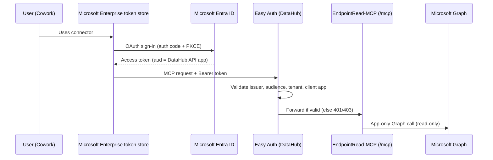

# 01 — Secure the EndpointRead-MCP-DataHub web app

**Goal:** Only signed-in members of the **EndpointRead-MCP-DataHub** group can call `/mcp`. Cowork gets 27 read-only tools, and every tool call finishes in under 30 seconds.

**Scope:** The **DataHub** web app only. The Copilot Studio web app (EndpointRead-MCP) isn't touched.

> Placeholders: `<DATAHUB_HOST>` (for example `<app>.<region>.azurewebsites.net`), `<TENANT_ID>`, `<API_CLIENT_ID>`.
> Don't paste real values into this repo.

Sources:
[App Service Entra auth](https://learn.microsoft.com/azure/app-service/configure-authentication-provider-aad) ·
[Plugin OAuth 2.0](https://learn.microsoft.com/microsoft-365-copilot/extensibility/plugin-authentication-oauth) ·
[Cowork plugins](https://learn.microsoft.com/microsoft-365/copilot/cowork/cowork-plugin-development)

---

## How it fits together



There are **two separate app registrations**:

| App registration | Purpose | Exists already? |
|---|---|---|
| Graph app (`CLIENT_ID` app setting) | The server calls Microsoft Graph with app-only `*.Read.All` permissions | Yes |
| **DataHub API app** (new, for example `EndpointRead-MCP-DataHub-API`) | Protects `/mcp`. It's also the OAuth client that Cowork uses to sign users in | **Create in Step 1** |

> **Test tenant exception (accepted):** the DataHub web app currently uses `EndpointRead-MCP-DataHub-API` for **both** roles. If you do this, that app also needs the Step 6 **Application** permissions. Split the roles into two app registrations before production.

---

## Step 1 — Create the DataHub API app registration

In plain words: this app is the "lock" on your MCP endpoint.

1. **Entra admin center → App registrations → New registration**
   - Name: `EndpointRead-MCP-DataHub-API`
   - Supported account types: **Single tenant**
   - Redirect URI (platform **Web**): `https://<DATAHUB_HOST>/.auth/login/aad/callback`
2. **Authentication → Web → Add URI**: `https://teams.microsoft.com/api/platform/v1.0/oAuthRedirect`
   This is where Microsoft 365 receives the sign-in result.
3. **Expose an API**
   - Application ID URI → **Add** → keep the default `api://<API_CLIENT_ID>` → **Save**
   - **Add a scope**: name `user_impersonation`, who can consent **Admins only**. Add a display name and description such as "Access EndpointRead-MCP DataHub".
4. **Manifest**: set `"requestedAccessTokenVersion": 2` (under `api`) → **Save**.
   This makes Entra issue v2 tokens that match the v2 issuer URL used in Step 2.
5. **Certificates & secrets → New client secret**. Copy the value **once**, straight into Step 5. Don't save it in files, chat, or this repo.
6. **API permissions → Add a permission → My APIs → EndpointRead-MCP-DataHub-API → Delegated → `user_impersonation`**. Also add **Microsoft Graph → Delegated → `offline_access`**. Then select **Grant admin consent**.
   > Provisioning doesn't check consent. Without admin consent, users later see "Need admin approval".

## Step 2 — Turn on Easy Auth on the DataHub web app

In plain words: App Service checks every request before your Python code runs.

**Azure portal → DataHub web app → Settings → Authentication → Add identity provider**

| Setting | Value |
|---|---|
| Identity provider | **Microsoft** |
| Tenant | **Workforce configuration (current tenant)** |
| App registration | **Pick an existing app registration in this directory** → `EndpointRead-MCP-DataHub-API` (or *Provide the details*: client ID, secret, issuer below) |
| Issuer URL | `https://login.microsoftonline.com/<TENANT_ID>/v2.0` |
| Client application requirement | **Allow requests only from this application itself** |
| Identity requirement | **Allow requests from any identity** (group restriction comes from Step 3) |
| Tenant requirement | **Allow requests only from the issuer tenant** / same tenant as the app registration |
| Allowed token audiences | `api://<API_CLIENT_ID>` (the client ID is accepted by default) |
| Restrict access | **Require authentication** |
| Unauthenticated requests | **HTTP 401 Unauthorized** (recommended for APIs) |
| Token store | Optional. The server doesn't use it, so you can leave it off. |

If you pick the express "create new registration" option instead, set the issuer to the `/v2.0` form afterward (express setup defaults to the legacy `sts.windows.net`).

## Step 3 — Allow only the approved group

1. **Entra admin center → Enterprise applications → EndpointRead-MCP-DataHub-API → Properties → Assignment required? = Yes → Save**
2. **Users and groups → Add user/group →** group **EndpointRead-MCP-DataHub** → **Assign**

Users outside the group can't get a token, so they never reach `/mcp`.

> Tip: the group and the web app share the same name. Check the object type (Group or App) when you select it.

## Step 4 — DataHub app settings (Environment variables)

**Azure portal → DataHub web app → Settings → Environment variables → App settings**

| Name | Value | Notes |
|---|---|---|
| `AUTH_MODE` | `app` | Already set |
| `MCP_ENABLED_TOOLS` | see below | **New.** Limits the tools Cowork can see and call |
| `REPORT_EXPORT_TIMEOUT_SECONDS` | `20` | **New.** Keeps report calls under Cowork's 30 s limit |
| `TENANT_ID`, `CLIENT_ID`, `CLIENT_SECRET` | (existing Graph app) | Unchanged. Prefer Key Vault references |
| `MICROSOFT_PROVIDER_AUTHENTICATION_SECRET` | (created by Easy Auth) | Slot-sticky. Prefer a Key Vault reference |

`MCP_ENABLED_TOOLS` (one line, no spaces):

```
test_connection,discover_graph_operations,get_intune_overview,manage_intune_devices,manage_intune_apps,manage_app_config_mam,manage_compliance_policies,manage_configuration_profiles,manage_settings_catalog,manage_admx_policies,manage_endpoint_security,manage_security_baselines,manage_windows_update,manage_intune_scripts,manage_intune_enrollment,manage_autopilot,manage_filters_tags,manage_intune_rbac,manage_cloud_pc,manage_entra_users,manage_entra_groups,manage_entra_devices,manage_conditional_access,manage_identity_protection,manage_app_registrations,manage_tenant_admin,manage_intune_reports
```

Excluded on purpose: `manage_device_encryption` (recovery keys) and the six interactive sign-in tools.

**Apply → Confirm** (the app restarts). The startup command stays the same.

## Step 5 — Create the OAuth client registration (used in Phase 3)

In plain words: this stores the client secret in Microsoft's token store, so it never appears in the plugin package.

**Teams developer portal → Tools → OAuth client registration → New OAuth client registration**

| Field | Value |
|---|---|
| Registration name | `EndpointRead-MCP-DataHub` |
| Base URL | `https://<DATAHUB_HOST>/mcp` |
| Restrict usage by org | **My organization only** |
| Restrict usage by app | **Any Teams app** (binding to a specific app ID causes 404s on every tool call) |
| Client ID | `<API_CLIENT_ID>` |
| Client secret | from Step 1.5 |
| Authorization endpoint | `https://login.microsoftonline.com/<TENANT_ID>/oauth2/v2.0/authorize` |
| Token endpoint | `https://login.microsoftonline.com/<TENANT_ID>/oauth2/v2.0/token` |
| Refresh endpoint | `https://login.microsoftonline.com/<TENANT_ID>/oauth2/v2.0/token` |
| Scope | `api://<API_CLIENT_ID>/user_impersonation offline_access` |
| PKCE | **Enabled** (default) |

**Save.** Then note the **OAuth client registration ID**. Phase 3 puts it in `authorization.referenceId` with `type: OAuthPluginVault`. It isn't a secret, but keep it in the environment file, not in docs.

## Step 6 — Graph permissions for the 27 tools (Graph app, not the API app)

The server calls Graph with the **existing Graph app**. Tools in new domains need extra **Application** permissions. A missing permission returns **403**, and the skills report it as "missing permission".

| Tool | Application permission(s) to verify | In README today? |
|---|---|---|
| Intune devices/apps/config/enrollment/Autopilot/RBAC/reports | `DeviceManagementManagedDevices.Read.All`, `DeviceManagementApps.Read.All`, `DeviceManagementConfiguration.Read.All`, `DeviceManagementServiceConfig.Read.All`, `DeviceManagementRBAC.Read.All` | Yes |
| Entra users/groups/devices | `User.Read.All`, `Group.Read.All`, `Device.Read.All` | Yes |
| `manage_intune_scripts` | `DeviceManagementConfiguration.Read.All` (some script endpoints may need `DeviceManagementScripts.Read.All`) | Partly |
| `manage_cloud_pc` | `CloudPC.Read.All` | No |
| `manage_conditional_access` | `Policy.Read.All` | No |
| `manage_identity_protection` | `AuditLog.Read.All`, `UserAuthenticationMethod.Read.All`, `Policy.Read.All`, `IdentityRiskyUser.Read.All`, `IdentityRiskEvent.Read.All` | Partly |
| `manage_app_registrations` | `Application.Read.All` | No |
| `manage_tenant_admin` | `Organization.Read.All`, `Domain.Read.All`, `ServiceHealth.Read.All`, `ServiceMessage.Read.All`, `RoleManagement.Read.Directory`, `Policy.Read.All`, `Agreement.Read.All` | Partly |

Check each endpoint against the official Graph API reference before you grant anything. Grant **read** permissions only.
**If the Copilot Studio web app uses the same Graph app**, the new permissions apply there too. Approve that with your security reviewer.

## Step 7 — Deploy the server change

The Phase 2 code (`MCP_ENABLED_TOOLS`, read-only annotations, report timeout cap) deploys on the next push to `main`. Both workflows run. The Copilot Studio app doesn't set the new app settings, so its behavior doesn't change (34 tools, 120 s report timeout).

## Step 8 — Validate

```powershell
cd integrations/m365-copilot-endpoint-intelligence/scripts
./Test-McpAuth.ps1 -McpUrl "https://<DATAHUB_HOST>/mcp"
```

Expected: every check is **PASS** (anonymous requests return **401**).

Signed-in tool listing (27 tools, all `readOnlyHint: true`) is checked in Phase 3, through Cowork.

---

## Troubleshooting

| Symptom | Likely cause | Fix |
|---|---|---|
| Anonymous call still returns 200 | Restrict access = "Allow unauthenticated" | Set **Require authentication** |
| Anonymous call returns 302 | Unauthenticated requests = "HTTP 302 Found redirect" | Set **HTTP 401 Unauthorized** |
| Signed-in calls return 401 | Issuer/token version mismatch | Step 1.4 (`requestedAccessTokenVersion: 2`) and the v2 issuer in Step 2 |
| Signed-in calls return 403 | Client app or tenant requirement doesn't match | Token must be issued to `<API_CLIENT_ID>` in your tenant |
| "Need admin approval" at sign-in | No admin consent | Step 1.6 |
| User can't sign in ("not assigned") | Not in the group | Add the user to **EndpointRead-MCP-DataHub** |
| Every tool call returns 404 in Cowork | OAuth registration bound to a specific app | Set **Any Teams app** |
| Tool returns `status: report_generating` | Intune report still being built | Expected. Ask again in a few minutes |
| Tool returns Graph 403 | Missing Graph application permission | Step 6 |
| App won't start after setting change | `REPORT_EXPORT_TIMEOUT_SECONDS` isn't a whole number | Use an integer such as `20` |
